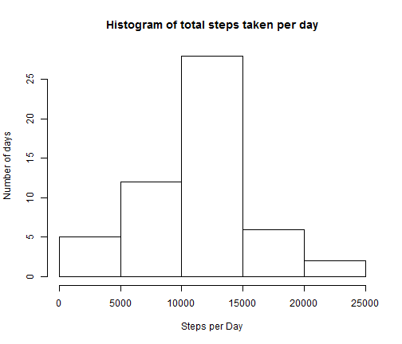
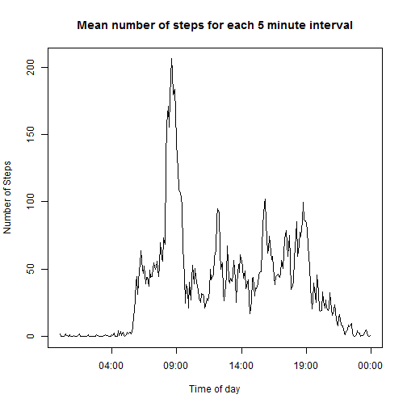
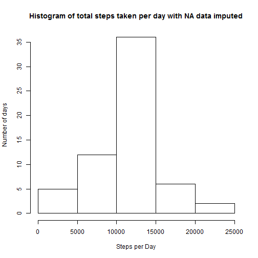
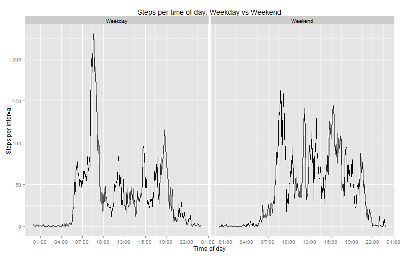

Reproducible Research
========================================================
# Peer Assessment 1
Data is read from activity.csv and the format of the date column is changed to date format (POSIXlt). The format in the interval 


```r
Sys.setenv(LANGUAGE="en")
setwd('C:/Users/Omar/Documents/R/Files/GitHubRepos/ReproducibleResearchPeerAssessment1')
activity <- read.csv('activity.csv')
activity$date <- strptime(as.character(activity$date),tz="GMT", "%Y-%m-%d")
activity$interval <- strptime(formatC(activity$interval/100, digits=2, format="f", width=5, flag=0),format="%H.%M")
```

Ignoring NAs the total number of steps each day is calucated using aggregate() and a histogram of for steps per day is drawn.  


```r
SumSteps_per_day <- aggregate(activity$steps, by = list(Date = as.character(activity$date)), sum)
SumSteps_per_day
```

```
##          Date     x
## 1  2012-10-01    NA
## 2  2012-10-02   126
## 3  2012-10-03 11352
## 4  2012-10-04 12116
## 5  2012-10-05 13294
## 6  2012-10-06 15420
## 7  2012-10-07 11015
## 8  2012-10-08    NA
## 9  2012-10-09 12811
## 10 2012-10-10  9900
## 11 2012-10-11 10304
## 12 2012-10-12 17382
## 13 2012-10-13 12426
## 14 2012-10-14 15098
## 15 2012-10-15 10139
## 16 2012-10-16 15084
## 17 2012-10-17 13452
## 18 2012-10-18 10056
## 19 2012-10-19 11829
## 20 2012-10-20 10395
## 21 2012-10-21  8821
## 22 2012-10-22 13460
## 23 2012-10-23  8918
## 24 2012-10-24  8355
## 25 2012-10-25  2492
## 26 2012-10-26  6778
## 27 2012-10-27 10119
## 28 2012-10-28 11458
## 29 2012-10-29  5018
## 30 2012-10-30  9819
## 31 2012-10-31 15414
## 32 2012-11-01    NA
## 33 2012-11-02 10600
## 34 2012-11-03 10571
## 35 2012-11-04    NA
## 36 2012-11-05 10439
## 37 2012-11-06  8334
## 38 2012-11-07 12883
## 39 2012-11-08  3219
## 40 2012-11-09    NA
## 41 2012-11-10    NA
## 42 2012-11-11 12608
## 43 2012-11-12 10765
## 44 2012-11-13  7336
## 45 2012-11-14    NA
## 46 2012-11-15    41
## 47 2012-11-16  5441
## 48 2012-11-17 14339
## 49 2012-11-18 15110
## 50 2012-11-19  8841
## 51 2012-11-20  4472
## 52 2012-11-21 12787
## 53 2012-11-22 20427
## 54 2012-11-23 21194
## 55 2012-11-24 14478
## 56 2012-11-25 11834
## 57 2012-11-26 11162
## 58 2012-11-27 13646
## 59 2012-11-28 10183
## 60 2012-11-29  7047
## 61 2012-11-30    NA
```

```r
hist(SumSteps_per_day$x, main= "Histogram of total steps taken per day", xlab = "Steps per Day", ylab ="Number of days")
```

 

```r
mean_sum_steps_per_day <- mean(SumSteps_per_day$x, na.rm=T)
median_sum_steps_per_day <-median(SumSteps_per_day$x, na.rm=T)
```

The mean number of steps observed each day was 10766.2 and the median number of steps per day was 10765.  


```r
Mean_steps_per_timeofDay <- aggregate(activity$steps, by = list(strftime(activity$interval, "%H:%M")), FUN=mean, na.rm=T)

plot(strptime(Mean_steps_per_timeofDay$Group.1, "%H:%M"), Mean_steps_per_timeofDay$x, type='l', main="Mean number of steps for each 5 minute interval", ylab= "Number of Steps", xlab="Time of day")
```

 

```r
MaxSteps <- max(Mean_steps_per_timeofDay$x)
MaxStepTime <- Mean_steps_per_timeofDay$Group.1[Mean_steps_per_timeofDay$x==MaxSteps]
```
The interval with the maximum number of steps of steps on average is the 5 minute interval that starts at 08:35 with an average of 206.2 steps in the interval.


```r
NAs <- sum(is.na(activity$steps))
unique(activity$date[is.na(activity$steps)])
```

```
## [1] "2012-10-01 GMT" "2012-10-08 GMT" "2012-11-01 GMT" "2012-11-04 GMT"
## [5] "2012-11-09 GMT" "2012-11-10 GMT" "2012-11-14 GMT" "2012-11-30 GMT"
```
There are a total of 2304 missing values for the number of steps in the dataset.  These missing values fall on 8 days where all data is missing.
I create a duplicate of the acitivty dataset, called activity_imputed.  To impute the missing values I add to each missing data point the mean number of steps for that interval from the rest of the dataset.


```r
activity_imputed <- activity
activity_imputed$time <- strftime(activity_imputed$interval, format("%H:%M"))
activity_imputed <- merge(activity_imputed, Mean_steps_per_timeofDay, by.x="time", by.y="Group.1", all.x=T)

activity_imputed$steps[is.na(activity_imputed$steps)] <- activity_imputed$x[is.na(activity_imputed$steps)]
SumSteps_per_day_imputed <- aggregate(activity_imputed$steps, by = list(Date = as.character(activity_imputed$date)), sum)

hist(SumSteps_per_day_imputed$x, main= "Histogram of total steps taken per day with NA data imputed", xlab = "Steps per Day", ylab ="Number of days")
```

 
The histogram of total number ofsteps per day with the imputed data is very similar to the histogram without the imputed dat except that the middle bar his higher.  This is somewhat expected as the 8 days that are imputed all get the same value, the mean, as their total number of steps per day.  This is due to the fact that the imputation is very limited.

```r
mean_sum_steps_per_day_imp <- mean(SumSteps_per_day_imputed$x, na.rm=T)
median_sum_steps_per_day_imp <-median(SumSteps_per_day_imputed$x, na.rm=T)
```
The mean number of steps observed each day after imputing the missing values with the mean of each interval was 10766.2 steps and the median number of steps per day was 10766.2.  
The imputation of the missing values has no effect on the mean sum of steps per day.  This is due to the fact that all the missing measurements fall on 8 days where no data is available.  Therefore the sum of each of these days is the mean of all the other days. The median value is not the same as with the un-imputed data but changes slightly and becomes the same as the mean.  This is beacuse 8 values of the mean are added to the dataset.
All in all the imputation does not have a significant effect on the results, this is partly due to the fact that the imputation is very rudimentary and might not be approriate in this case.

Lastly I look at the difference between Weekdays and Weekend in the data.  For that I look at the mean of each interval for weekends and weekdays. The results are plotted in the panel-plot below.


```r
library(ggplot2)
library(scales)
#laugardagur=Saturday and sunnudagur=Sunday, could not change language settings to english for R-markdown
activity_imputed$WeekDay_End[!weekdays(activity_imputed$date) %in% c('laugardagur', 'sunnudagur') ] <- 'Weekday'
activity_imputed$WeekDay_End[weekdays(activity_imputed$date) %in% c('laugardagur', 'sunnudagur') ] <- 'Weekend'
activity_imputed$WeekDay_End <- as.factor(activity_imputed$WeekDay_End)
Mean_steps_per_timeofDay_Weekend_Weekday <- aggregate(steps ~ time + WeekDay_End, data=activity_imputed, FUN=mean)

ggplot(Mean_steps_per_timeofDay_Weekend_Weekday,aes(x=strptime(time,"%H:%M"), y=steps))+geom_line() +facet_grid(.~WeekDay_End) + scale_x_datetime(labels = date_format("%H:%M"),breaks = "3 hour") + labs(x='Time of day', y='Steps per interval', title='Steps per time of day, Weekday vs Weekend')  
```

 
The two plots clearly shows that there is a clear difference between weekdays and weekends in terms of number of steps, where the activity starts earlier in the weekdays and there is a very large peak around 8:00.  The weekends on the other hand have a more even activity over the day with fewer and shorter periods of activity below 50 steps per interval. 
